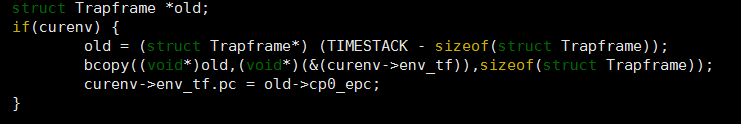

### Thinking 3.1
为什么我们在构造空闲进程链表时必须使用特定的插入的顺序？(顺序或者逆序)
采用时间片轮转算法时，要保证FIFO，先来的先被分配，所以从envs数组的envs[0]开始轮转，采用逆序插入，才能保证算法的正确性。

### Thinking 3.2 思考env.c/mkenvid 函数和envid2env 函数:
• 请你谈谈对mkenvid 函数中生成id 的运算的理解，为什么这么做？
• 为什么envid2env 中需要判断e->env_id != envid 的情况？如果没有这步判断会发生什么情况？

 - ![mkenvid函数][1]
 首先e-envs计算出进程e在envs数组中的位置，可见next_env_id是一个静态变量，所以envid由两个部分生成，高位是逐渐增加的数字，低位是当前进程在进程数组中的位置，这样做可以保证每一个进程的id是唯一的。
 -  e = &envs[ENVX(envid)]，e->env_id != envid是为了判断是否从envs数组中成功取出了进程。如果不判断，可能envid不为零但是是非法id，这种情况下获取的e变量非法。

  [1]: ./images/1525183977557.jpg
  
 ### Thinking 3.3
结合include/mmu.h 中的地址空间布局，思考env_setup_vm 函数：
• 我们在初始化新进程的地址空间时为什么不把整个地址空间的pgdir 都清零，而是复制内核的boot_pgdir作为一部分模板？(提示:mips 虚拟空间布局)
• UTOP 和ULIM 的含义分别是什么，在UTOP 到ULIM 的区域与其他用户区相比有什么最大的区别？
• 在step4 中我们为什么要让pgdir[PDX(UVPT)]=env_cr3?(提示: 结合系统自映射机制)
• 谈谈自己对进程中物理地址和虚拟地址的理解
（1）mips采用虚拟地址，每一个进程都有4G的独立虚拟地址，所以不能直接将地址空间的pgdir清零(只需要将UTOP到0xffffffff的内核态地址清零)，而是对每一个进程单独地赋值boot_pgdir作为模板。
（2）UTOP以下的空间用户有访问内存的权限，ULIM的含义是用户访问权限的上限，对于ULIM以上的区域用户没有访问内存的权限。UTOP到ULIM之间的区域，内核和用户(user environment)有相同的权限：可以读但是不能够写。
（3）操作系统为每一个进程创建一个虚拟地址空间和PCB，32位系统中虚拟空间大小为4G。进程不是直接访问物理地址，而是访问对应的虚拟地址，同时使用页表机制将虚拟地址映射到实际的物理地址。

### Thinking 3.4 
思考user_data 这个参数的作用。没有这个参数可不可以？为什么？（如果你能说明哪些应用场景中可能会应用这种设计就更好了。可以举一个实际的库中的例子）
user_data函数用于在load_icode_mapper和load_elf文件之间传递参数。如果没有这个参数，那么不容易区别不同进程之间这两个函数需要的数据。实际举例来说，对于I/O进程，user_data可能是同一个进程中需要传递的接受输入和输出的参数，保证数据在同一个读写进程中传递。

### Thinking 3.5 
结合load_icode_mapper 的参数以及二进制镜像的大小，考虑该函数可能会面临哪几种复制的情况？你是否都考虑到了？ 
可能会遇到两种复制情况：第一种是加载二进制内容到内存之后,bin_size < sgsize，那么还需要将剩下的内存空间填充0；第二种情况是加载二进制内容之后，刚好填充完，不需要进行置零处理。

### Thinking 3.6 
思考上面这一段话，并根据自己在lab2 中的理解，回答：
• 我们这里出现的” 指令位置” 的概念，你认为该概念是针对虚拟空间，还是物理内存所定义的呢？
• 你觉得entry_point其值对于每个进程是否一样？该如何理解这种统一或不同？
(1)因为进程都是通过访问虚拟地址间接访问物理地址的，所以“指令位置”指的是虚拟地址；
(2)entry_point的值对每个进程是一样的，因为MMU的存在，所以即使进程的虚拟地址相同，所映射的物理内存地址是不同的。

### Thinking 3.7 
思考一下，要保存的进程上下文中的env_tf.pc的值应该设置为多少？为什么要这样设置？
env_tf.pc应该设置成cp0_epc($14)的值，这个寄存器的作用是存放异常发生时，系统正在执行的指令的地址。所以当进程切换到原来的进程时读取cp0_epc寄存器的值，拿出上次执行指令的地址。

### Thinking 3.8 
思考TIMESTACK 的含义，并找出相关语句与证明来回答以下关于TIMESTACK 的问题：
• 请给出一个你认为合适的TIMESTACK 的定义
• 请为你的定义在实验中找出合适的代码段作为证据(请对代码段进行分析)
• 思考TIMESTACK 和第18 行的KERNEL_SP 的含义有何不同
(1)从字面含义上看是一个时间栈，值是0x8200 0000的地址，作用是保存进程切换时上下文的栈。
(2)进程运行时将上一个进程的现场copy到curenv的env_tf中

进程销毁的时候将Kernel_sp copy到TIMESTACK结构中

(3)

